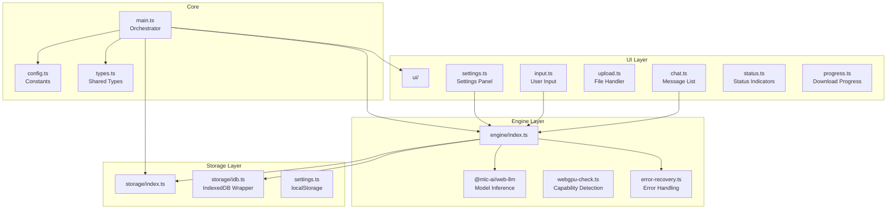
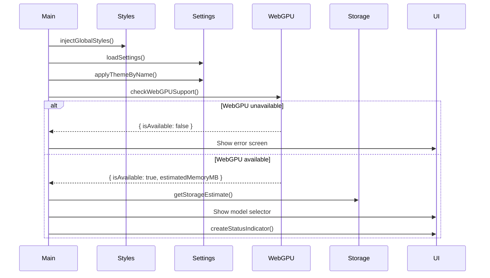
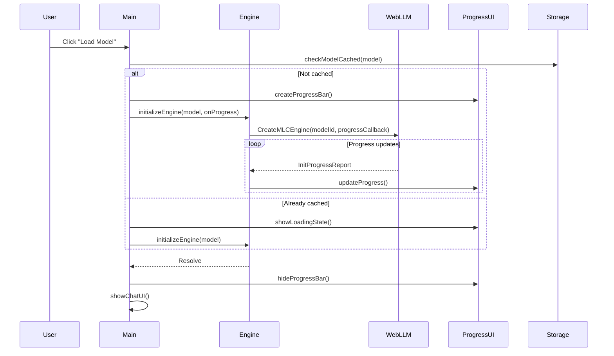
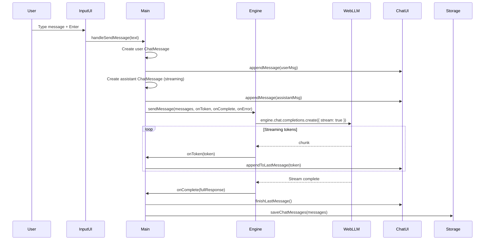
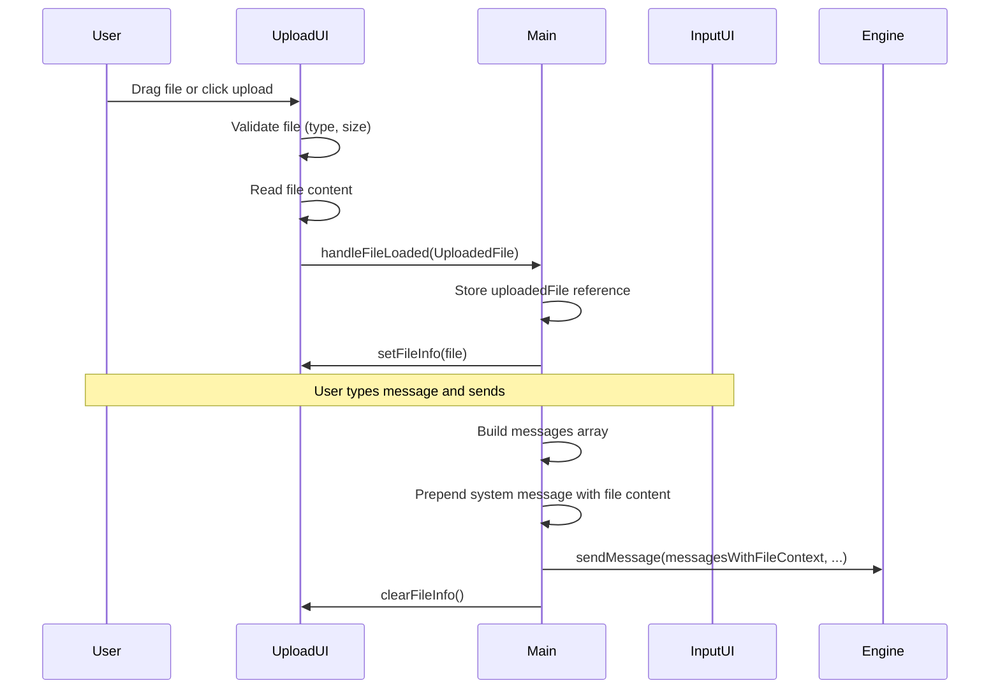

# WebLM Architecture Documentation

*Version 0.9.0*

## 1. Overview

WebLM is a local-first AI chat application powered by Gemma 2 via WebLLM. It runs entirely in the browser with zero server dependencies, prioritizing user privacy and offline capability.

### Core Principles

- **Single HTML file output** — Built via Vite + vite-plugin-singlefile, producing a self-contained distributable package
- **Zero-server architecture** — All processing happens client-side; no data leaves the user's browser
- **Privacy-first** — No analytics, no telemetry, no external API calls
- **WebGPU-powered** — Leveraging browser GPU acceleration for fast LLM inference

### Technology Stack

| Layer | Technology |
|-------|-------------|
| Runtime | Bun (development), Browser (production) |
| Build | Vite + vite-plugin-singlefile |
| Inference | @mlc-ai/web-llm (WebGPU) |
| Storage | IndexedDB (models, chat), localStorage (settings) |
| Language | TypeScript (strict mode) |

---

## 2. File Structure

```
weblm/
├── index.html              # Entry HTML (dev), template for build
├── package.json            # Dependencies and npm scripts
├── tsconfig.json           # TypeScript strict configuration
├── vite.config.ts          # Vite config with COOP/COEP headers
├── bun.lock                # Bun lockfile
│
├── public/
│   ├── sw.js              # Service worker (COOP/COEP injection)
│   ├── manifest.json      # PWA manifest
│   └── favicon.svg        # Application icon
│
├── scripts/
│   ├── dev.ts             # Development server launcher
│   └── build.ts           # Production build script
│
└── src/
    ├── main.ts            # Application orchestrator and entry point
    ├── config.ts          # Model IDs, defaults, constants
    ├── types.ts           # Shared type definitions
    ├── settings.ts        # User preferences persistence
    │
    ├── engine/            # WebLLM integration layer
    │   ├── index.ts       # Public API: initialize, sendMessage, etc.
    │   ├── types.ts       # Engine-specific types (ModelState, ProgressCallback)
    │   ├── webgpu-check.ts# WebGPU capability detection
    │   └── error-recovery.ts# Error categorization and recovery logic
    │
    ├── storage/           # Persistence layer
    │   ├── index.ts       # Public API: model cache status, storage estimates
    │   ├── idb.ts         # IndexedDB wrapper for chat history
    │   └── types.ts       # Storage-related types
    │
    ├── ui/                # User interface components
    │   ├── index.ts       # Module barrel (empty, for documentation)
    │   ├── styles.ts      # CSS-in-JS theming (light/dark/system)
    │   ├── status.ts      # Status indicators (WebGPU, online, model)
    │   ├── progress.ts    # Model download progress bar
    │   ├── chat.ts        # Chat message list with markdown rendering
    │   ├── input.ts       # Message input with keyboard shortcuts
    │   ├── upload.ts      # File upload (drag-drop, picker)
    │   ├── settings.ts    # Settings panel (model, generation, theme)
    │   ├── markdown.ts    # Lightweight markdown parser (no deps)
    │   ├── highlight.ts   # Simple syntax highlighter (no deps)
    │   └── metrics.ts     # Performance tracking (TTFT, tokens/sec)
    │
    └── types/
        └── webgpu.d.ts    # WebGPU type declarations
```

---

## 3. Architecture Diagram



---

## 4. Key System Components

### 4.1 `src/main.ts` — Orchestrator

**Purpose**: Application entry point that initializes and coordinates all subsystems.

**Public API**: None (module is side-effect only)

**Dependencies**:
- `engine/` — Model initialization and message generation
- `storage/` — Chat history persistence
- `ui/` — All UI components
- `config` — Model configuration
- `settings` — User preferences

**Key Functions**:
```typescript
async function init(): Promise<void>
async function showChatUI(): Promise<void>
async function handleSendMessage(userMessage: string): Promise<void>
async function handleLoadModel(model: ModelVariant, ...): Promise<void>
async function handleModelSwitch(newModel: ModelVariant): Promise<void>
```

**Notes**:
- Manages global application state (current model, messages, uploaded file)
- Coordinates UI lifecycle from model selection to chat interface
- Handles error recovery for model loading failures

---

### 4.2 `src/config.ts` — Configuration

**Purpose**: Central configuration for models and application defaults.

**Exports**:
```typescript
export const MODEL_IDS: Record<ModelVariant, string>
export type ModelVariant = 'small' | 'large'
export const DEFAULT_MODEL: ModelVariant
export const MODEL_INFO: Record<ModelVariant, {...}>
export const DEFAULT_GENERATION_CONFIG: { temperature, maxTokens, stream, topP }
export const STORAGE_KEYS: { database, models, settings }
export const UI_CONFIG: { autoScrollThreshold, inputMaxHeight, themeKey }
export const MEMORY_THRESHOLDS: { minSmall, minLarge }
```

**Notes**:
- Uses Gemma 2 models (2B and 9B quantized) as Gemma 4 is not yet available in WebLLM
- Small model is default for broader hardware compatibility

---

### 4.3 `src/types.ts` — Shared Types

**Purpose**: Common type definitions used across modules.

**Exports**:
```typescript
export type MessageRole = 'user' | 'assistant' | 'system'
export interface ChatMessage {
  id: string
  role: MessageRole
  content: string
  timestamp: string
  streaming?: boolean
}
export interface AppState { modelState, loadedModel, messages, isGenerating, error, offlineMode }
export interface GenerationOptions { temperature?, maxTokens?, systemPrompt? }
export function generateId(): string
```

---

### 4.4 `src/settings.ts` — Settings Persistence

**Purpose**: User preferences storage in localStorage.

**Exports**:
```typescript
export type Theme = 'light' | 'dark' | 'system'
export interface AppSettings { temperature, maxTokens, topP, systemPrompt, theme, showMetrics }
export function loadSettings(): AppSettings
export function saveSettings(settings: Partial<AppSettings>): void
export function resetSettings(): void
export function getTemperature(): number
export function setTemperature(value: number): void
export function getMaxTokens(): number
export function setMaxTokens(value: number): void
export function getTopP(): number
export function setTopP(value: number): void
export function getSystemPrompt(): string
export function setSystemPrompt(value: string): void
export function getTheme(): Theme
export function setTheme(value: Theme): void
export function getEffectiveTheme(): 'light' | 'dark'
export function getShowMetrics(): boolean
export function setShowMetrics(value: boolean): void
```

---

### 4.5 `src/engine/index.ts` — WebLLM Integration

**Purpose**: Model lifecycle management and streaming inference.

**Exports**:
```typescript
export async function initializeEngine(model: ModelVariant, onProgress?: ProgressCallback): Promise<void>
export async function sendMessage(messages: ChatMessage[], onToken, onComplete, onError, options?): Promise<void>
export function stopGeneration(): void
export function getEngine(): MLCEngine | null
export function isModelLoaded(): boolean
export function getCurrentModel(): ModelVariant | null
export function getIsGenerating(): boolean
export async function unloadEngine(): Promise<void>
export async function deleteCachedModel(model: ModelVariant): Promise<void>
export async function isModelCached(model: ModelVariant): Promise<boolean>
export async function getStorageEstimate(): Promise<{ quota, usage }>
export type { MLCEngine, InitProgressReport }
```

**Dependencies**:
- `@mlc-ai/web-llm` — External WebLLM library
- `./config` — Model IDs and variants
- `./types` — Progress callback types

**Notes**:
- Maintains singleton engine instance
- Progress reporting during model download/compilation
- Streaming token delivery via async generator pattern

---

### 4.6 `src/engine/webgpu-check.ts` — Capability Detection

**Purpose**: WebGPU availability checking and adapter info.

**Exports**:
```typescript
export interface WebGPUCapabilities {
  isAvailable: boolean
  maxBufferSize?: number
  estimatedMemoryMB?: number
  unavailableReason?: string
}
export async function checkWebGPUSupport(): Promise<WebGPUCapabilities>
export const WEBGPU_BROWSER_RECOMMENDATIONS: string[]
```

**Notes**:
- Called on app initialization to gate access
- Returns user-friendly error messages for unsupported browsers

---

### 4.7 `src/engine/error-recovery.ts` — Error Handling

**Purpose**: Error categorization, tracking, and recovery recommendations.

**Exports**:
```typescript
export type ErrorCategory = 'oom' | 'device-lost' | 'network' | 'validation' | 'unknown'
export function categorizeError(error: Error): ErrorCategory
export function getErrorMessage(category: ErrorCategory, originalError: Error): string
export function trackError(category: ErrorCategory, error: Error): void
export function getRecentErrorCount(category: ErrorCategory, withinMs?: number): number
export function canAutoRecover(category: ErrorCategory, currentModel: ModelVariant): boolean
export function getRecoveryAction(category: ErrorCategory, currentModel: ModelVariant): RecoveryResult
export function checkMemorySufficient(model: ModelVariant): { sufficient, available, required }
export function getMemoryWarning(model: ModelVariant): string | null
export function clearErrorHistory(): void
```

**Notes**:
- Provides actionable recovery suggestions (e.g., "switch to smaller model")
- Tracks error frequency for intelligent recovery decisions

---

### 4.8 `src/storage/index.ts` — Storage Public API

**Purpose**: Model cache status and storage quota utilities.

**Exports**:
```typescript
export async function checkModelCached(model: ModelVariant): Promise<boolean>
export async function clearCachedModel(model: ModelVariant): Promise<void>
export async function getStorageEstimate(): Promise<{ quota, usage, available }>
export function formatBytes(bytes: number): string
export async function getStorageStatus(): Promise<string>
```

---

### 4.9 `src/storage/idb.ts` — IndexedDB Wrapper

**Purpose**: Chat history persistence.

**Exports**:
```typescript
export async function openChatDatabase(): Promise<IDBDatabase>
export async function saveChatMessages(messages: ChatMessage[]): Promise<void>
export async function loadChatMessages(): Promise<ChatMessage[]>
export async function clearChatMessages(): Promise<void>
export async function appendChatMessage(message: ChatMessage): Promise<void>
```

**Notes**:
- Separate database (`weblm-chat`) from WebLLM's model cache
- Simple append-only for incremental updates

---

### 4.10 `src/ui/styles.ts` — Theming

**Purpose**: CSS-in-JS styling with light/dark/system themes.

**Exports**:
```typescript
export interface Theme { primary, background, surface, text, textSecondary, border, error, success }
export const lightTheme: Theme
export const darkTheme: Theme
export function applyTheme(theme: Theme): void
export function applyThemeByName(themeName: 'light' | 'dark' | 'system'): void
export function watchSystemTheme(callback: () => void): () => void
export function createStyles(styles: Record<string, string>): string
export function injectGlobalStyles(): void
```

**Notes**:
- CSS custom properties for dynamic theming
- ~1300 lines of embedded CSS in `injectGlobalStyles()`
- System theme watches `prefers-color-scheme` media query

---

### 4.11 `src/ui/chat.ts` — Chat Message Display

**Purpose**: Message rendering with markdown and real-time streaming.

**Exports**:
```typescript
export function createChatContainer(parent: HTMLElement): HTMLElement
export function getMessagesContainer(): HTMLElement | null
export function destroyChatContainer(): void
export function renderChatMessages(container: HTMLElement, messages: ChatMessage[]): void
export function appendMessage(container: HTMLElement, message: ChatMessage): HTMLElement
export function updateLastMessage(container: HTMLElement, content: string): void
export function appendToLastMessage(container: HTMLElement, token: string): void
export function finishLastMessage(container: HTMLElement, message: ChatMessage): void
export function scrollToBottom(container: HTMLElement): void
export function clearChat(container: HTMLElement): void
export function showTypingIndicator(container: HTMLElement, id: string): void
export function hideTypingIndicator(container: HTMLElement): void
export function startTimestampUpdates(): void
export function stopTimestampUpdates(): void
```

**Dependencies**:
- `./markdown` — Markdown rendering
- `./highlight` — Syntax highlighting

---

### 4.12 `src/ui/input.ts` — Message Input

**Purpose**: Textarea with send/stop controls and keyboard shortcuts.

**Exports**:
```typescript
export function createMessageInput(container: HTMLElement, onSend: (message: string) => void, onStop?: () => void): void
export function setInputDisabled(disabled: boolean): void
export function clearInput(): void
export function focusInput(): void
export function getInputValue(): string
export function setPlaceholder(text: string): void
```

**Notes**:
- Enter to send, Shift+Enter for newline
- Auto-growing textarea
- Disabled state during generation

---

### 4.13 `src/ui/upload.ts` — File Upload

**Purpose**: Drag-and-drop and click-to-upload file handling.

**Exports**:
```typescript
export interface UploadedFile { name, content, size, type }
export function createUploadUI(chatContainer, inputContainer, onFileLoaded, onFileClear): {...}
```

**Notes**:
- Supports .txt, .md, .csv, .json (max 5MB)
- File content injected as system message context

---

### 4.14 `src/ui/markdown.ts` — Markdown Renderer

**Purpose**: Lightweight regex-based markdown parsing (no dependencies).

**Exports**:
```typescript
export function renderMarkdown(text: string): string
export function renderPlainText(text: string): string
```

**Supported Syntax**:
- Headings (h1-h3)
- Bold, italic, bold+italic
- Inline code, code blocks
- Links
- Lists (ordered/unordered)
- Blockquotes
- Horizontal rules

---

### 4.15 `src/ui/highlight.ts` — Syntax Highlighter

**Purpose**: Lightweight code highlighting (no dependencies).

**Exports**:
```typescript
export function highlightCode(code: string, language: string): string
export function getHighlightStyles(): string
```

**Supported Languages**:
- JavaScript, TypeScript
- Python
- JSON
- HTML, CSS
- Bash/Shell

---

### 4.16 `src/ui/metrics.ts` — Performance Tracking

**Purpose**: Time-to-first-token and tokens-per-second measurement.

**Exports**:
```typescript
export interface GenerationMetrics { ttft, totalTime, tokenCount, tokensPerSecond, timestamp }
export function isMetricsEnabled(): boolean
export function setMetricsEnabled(enabled: boolean): void
export function loadMetricsPreference(): void
export function onMetrics(callback: (metrics) => void): () => void
export function startGeneration(): void
export function recordFirstToken(): void
export function incrementTokenCount(): void
export function completeGeneration(): GenerationMetrics | null
export function formatTTFT(ttftMs: number): string
export function formatTokensPerSecond(tps: number): string
export function formatTime(ms: number): string
export function createMetricsElement(metrics: GenerationMetrics): HTMLElement
export function estimateTokenCount(text: string): number
```

---

### 4.17 `src/sw.ts` — Service Worker Registration

**Purpose**: PWA offline support and COOP/COEP header injection.

**Exports**:
```typescript
export async function registerServiceWorker(): Promise<void>
export function isServiceWorkerActive(): boolean
export function isOfflineReady(): boolean
export function onOfflineStatusChange(callback: (isOffline, isReady) => void): () => void
export function setupOfflineDetection(): void
export function isOnline(): boolean
```

---

### 4.18 `public/sw.js` — Service Worker (Plain JS)

**Purpose**: Cache management and COOP/COEP header injection for SharedArrayBuffer.

**Key Features**:
- Caches app shell for offline use
- Injects `Cross-Origin-Opener-Policy: same-origin`
- Injects `Cross-Origin-Embedder-Policy: require-corp`
- Required for WebLLM's SharedArrayBuffer usage on static hosting

---

### 4.19 `scripts/build.ts` — Production Build

**Purpose**: Wrapper for Vite production build.

**Command**: `bun run build`

**Output**: Single `dist/index.html` file with all assets inlined.

---

### 4.20 `scripts/dev.ts` — Development Server

**Purpose**: Wrapper for Vite dev server.

**Command**: `bun run dev`

**Features**: Starts Vite with COOP/COEP headers for local development.

---

## 5. Data Flow Diagrams

### 5.1 App Initialization Flow



---

### 5.2 Model Loading Flow



---

### 5.3 Chat Message Flow



---

### 5.4 File Upload Flow



---

## 6. Storage Architecture

### 6.1 IndexedDB Databases

| Database | Object Store | Purpose |
|----------|--------------|---------|
| `weblm-chat` | `messages` | Chat history (messages with id, role, content, timestamp) |
| `webllm-cache` | (WebLLM managed) | Model weights and compiled shaders |

### 6.2 localStorage Keys

| Key | Type | Purpose |
|-----|------|---------|
| `weblm-temperature` | number | Generation temperature (default: 0.7) |
| `weblm-max-tokens` | number | Max response tokens (default: 2048) |
| `weblm-top-p` | number | Top-p sampling (default: 0.95) |
| `weblm-system-prompt` | string | System prompt for all conversations |
| `weblm-theme` | 'light' \| 'dark' \| 'system' | UI theme preference |
| `weblm-show-metrics` | boolean | Show TTFT/tokens/sec metrics |

---

## 7. Design Decisions

### 7.1 Why Single HTML File?

- **Distribution simplicity**: One file to download, no build steps for end users
- **Offline-first**: All assets bundled, works without network after first load
- **Self-contained**: No external dependencies at runtime
- **Privacy**: No CDN calls, no analytics beacons

**Implementation**: `vite-plugin-singlefile` inlines all JS, CSS, and assets into the HTML bundle during build.

---

### 7.2 Why No Framework (Vanilla DOM)?

- **Bundle size**: A single HTML file should be small; React/Vue/Svelte add significant KB
- **Complexity**: Simple chat UI doesn't need framework abstractions
- **Performance**: Direct DOM manipulation is faster than virtual DOM reconciliation
- **Learning curve**: Easier to contribute without framework-specific knowledge

**Trade-off**: More manual state management, but acceptable for this scope.

---

### 7.3 Why Lightweight Markdown/Syntax Highlighting?

- **Bundle size**: Marked.js + highlight.js would add ~100KB+ minified
- **LLM output needs**: Most LLM output uses basic markdown (headers, code blocks, lists)
- **Performance**: Regex-based parsing is fast enough for typical message lengths

**Implementation**: `markdown.ts` and `highlight.ts` are ~200 lines total, supporting common patterns.

---

### 7.4 Why WebLLM Handles Model Caching?

- **Automatic**: WebLLM caches models in IndexedDB automatically
- **Optimized**: Uses efficient binary format and incremental caching
- **Progress**: Built-in progress reporting for download/compilation

**Trade-off**: Less control over cache location/format, but simpler implementation.

---

### 7.5 Why COOP/COEP Service Worker Hack?

- **SharedArrayBuffer requirement**: WebLLM needs SharedArrayBuffer for WASM
- **Static hosting**: GitHub Pages, Netlify, etc. don't allow custom headers
- **Service worker workaround**: Inject headers at fetch time

**Implementation**: `public/sw.js` intercepts requests and adds required headers.

**Limitation**: Requires the app to be served from a service worker context.

---

## 8. Dependencies

### Production Dependencies

```json
{
  "@mlc-ai/web-llm": "^0.2.82"
}
```

### Development Dependencies

```json
{
  "@types/bun": "latest",
  "esbuild": "^0.28.0",
  "vite": "^8.0.8",
  "vite-plugin-singlefile": "^2.3.2",
  "typescript": "^5"
}
```

---

## 9. Browser Compatibility

| Browser | Minimum Version | Notes |
|---------|-----------------|-------|
| Chrome | 121+ | Full WebGPU support |
| Edge | 121+ | Full WebGPU support |
| Safari | 18+ | WebGPU support added |
| Firefox | Nightly | Requires `dom.webgpu.enabled` flag |

**WebGPU is required** — The app gates access and shows helpful error messages for unsupported browsers.

---

## 10. Security Considerations

1. **No server communication**: All processing is client-side
2. **No external API calls**: Model runs in WebGPU sandbox
3. **No user tracking**: No analytics, no cookies for tracking
4. **XSS prevention**: HTML escaping in markdown renderer
5. **File upload limits**: Max 5MB, text-only files

---

## 11. Future Considerations

1. **Custom model loading**: Allow users to load local model files
2. **Conversation management**: Multiple chat sessions, export/import
3. **Model switching without chat clear**: State management for context
4. **RAG integration**: File processing for retrieval-augmented generation
5. **Voice input**: Speech-to-text for message input